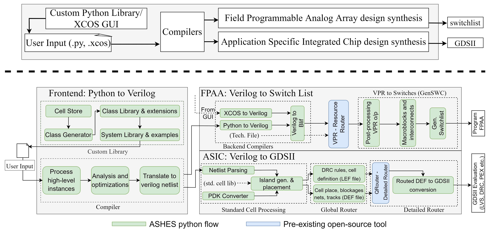

# Welcome to ASHES

**Analog Synthesis for High Level Systems (ASHES)** is an in-development open-source framework that is capable of programming Field Programmable Analog Array (FPAAs) or generating tapeout files (.gds) for analog computing applications using a programmable 
analog standard cell library.

This site contains an ongoing documentation of the Python toolflow of ASHES. The current purpose of this documentation is to create an accessible and formal record of all the Python functions and behaviors, ith the end goal being a formal documentation of the entire ASHES library.

<!-- ## Table of Contents -->

<!-- ## Commands

* `mkdocs new [dir-name]` - Create a new project.
* `mkdocs serve` - Start the live-reloading docs server.
* `mkdocs build` - Build the documentation site.
* `mkdocs -h` - Print help message and exit.

## Project layout

    mkdocs.yml    # The configuration file.
    docs/
        index.md  # The documentation homepage.
        ...       # Other markdown pages, images and other files. -->
