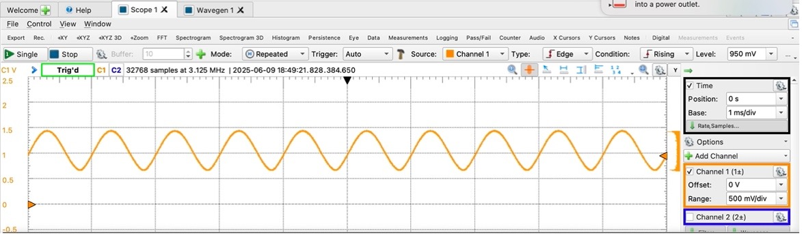

# Using Python for FPAA Programming

This tutorial introduces the fundamental steps to program the FPAA using Ashes. This tutorial assumes that you have already installed all the necessary dependencies in an existing Python interpreter.

1. Open VSCode (or your desired IDE)
2. Navigate to `/ashes/ashes_fg/examples.py`, which contains the definition of some basic example circuits.
3. Do not modify the `examples.py` file. Instead, create a copy or another file and adjust the CABs location and IO pins. For this tutorial, we will only program the `ors_buffer`.
4. Reprogram `ors_buffer` as follows:
    ``` python
    def ors_buffer():
        inpad1 = fg.inpad([5])                              # Set input pin to IOPad 5
        buff_out = fg.ota_buf(inpad1, fix_loc = [1, 5, 6])  # Enable CAB at col=5, row=6
        outpad = fg.outpad(buff_out, [6])                   # Set output pin to IOPad 6
    ```
5. Open `/ashes/ORS_run_me.py`. This is the run file to compile and program the circuit on the FPAA.
6. Modify `ORS_run_me.py`:
    - Ensure you import `ors_buffer` from your copy of `example.py`.
    - Change circuit name to the desired circuit and change the project name to whatever you desire. The project name dictates the name of the folder that will store all the intermediary output files. Also update the chip number so that it corresponds to the board you are programming
7. You should end up with something similar to the following for `ORS_run_me.py`:
    ``` python
    import ashes_fg as af
    from ashes_fg.examples_copy import ors_buffer

    af.fpaa.compile(ors_buffer, project_name='ors_buffer', chip_num=13)
    ```
8. Run the file via terminal
    - Navigate directory to `ashes`
        ``` bash
        cd ~/ashes
        ```
    - Run `ORS_run_me.py`
        ``` bash
        python ORS_run_me.py
        ```
    - Input password for sudo access if inquired.
    - When the routing app window from vpr pops up, confirm the correct CAB location has been chosen, then close the pop-up to continue the process.
9. Use waveforms and Analog Discovery to check buffer functionality
    - Connect wavegen 1 to IOpad_5 (input)
    - Connect scope 1+ to IOpad_6 (output)
    - Ground the Analog Discovery and scope wires to FPAA GND
    - Set the wavegenerator to generate the following input wave:
        - Sinewave
        - Amplitude: 350 mV
        - Offset: 1.2 V (increase the offset to 1.4 V if the bottom of the signal is distorted)
        - Frequency: 1 kHz
10. You should expect the output wave to look as follows:
    